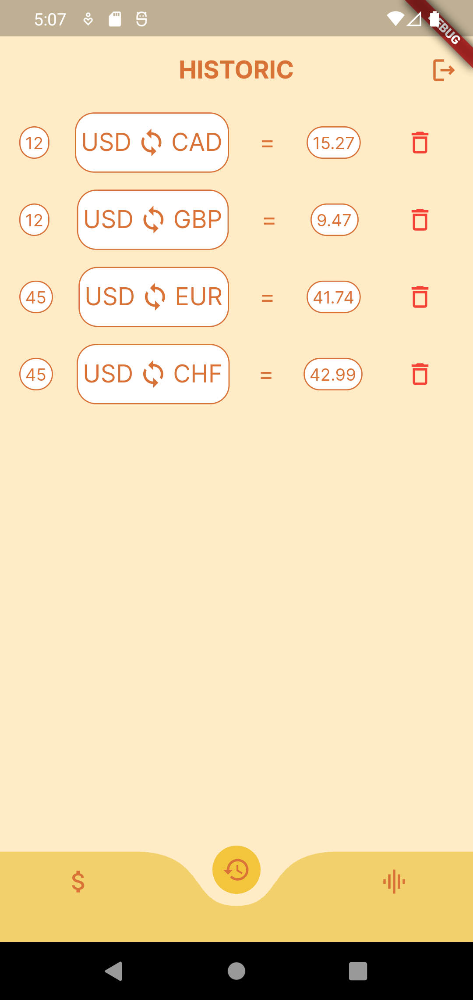

# Convert coin App

This project was proposed on a training course organized by Snowman Labs. Its main purpose is to allow users to convert coins and store it for future purposes.

As you can see on the images bellow, you need to login on our app. You can login with a Google Account or create a new profile. When you click on the phrase 'Don't have an account?', you will be redirected to a register page, as seen on the third image bellow.

<div style="display: flex;">
&nbsp;&nbsp;
&nbsp;&nbsp;

</div>

When you login to our app, the screenshots illustrated on the images bellow is shown. The first screen is a page where you type a number to convert to a different coin. The second screen shows different convertions made by you in the past. As you can see, you have the option to delete the convertions as well, it can be done if you click in the trash can positioned on the right corner of each convertion.

<div style="display: flex;">
&nbsp;&nbsp;

</div>

## How to get its code

This project was developed using:
- Flutter
- Dart
- Visual Studio Code
- Flutter Public Package:
    - Mobx
    - DIO
    - Firebase Authentication
    - Google Sign In
    - Cloud Firestore
    - Curved Navigation Bar
    - Google_fonts
    - Lottie
    - build_runner
    - mobx_codegen

To download this project and make changes, you can use the script bellow:

```
git clone https://github.com/EmmanuelPereira1/convert_coin.git
```